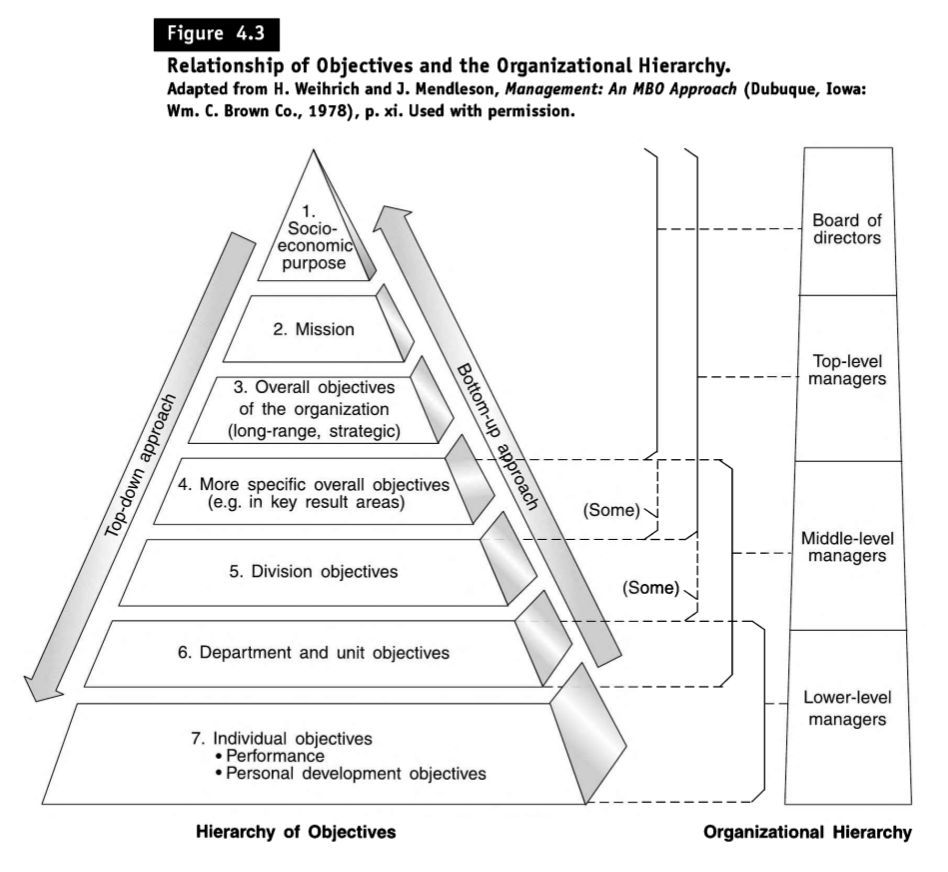
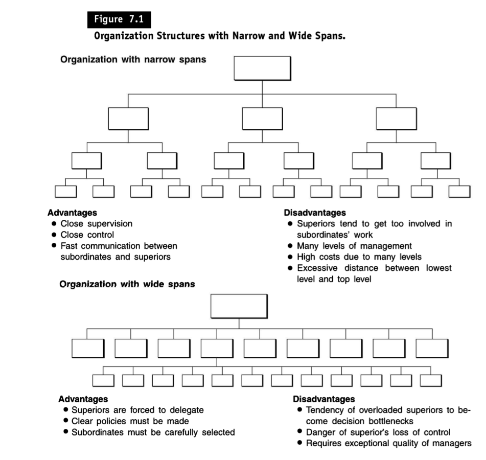

## What is Management?

The sources provide a concise definition of management: **"Management is the process of designing and maintaining an environment in which individuals, working together in groups, efficiently accomplish selected aims"**. This definition highlights several key aspects of management:

- **It's a process:** Management is not a static activity but rather a dynamic and ongoing series of actions and decisions.
- **Focus on environment:** Managers create and shape the environment within which individuals and groups operate to achieve organizational goals.
- **Group effort:** Management emphasizes teamwork and collaboration to achieve common objectives.
- **Efficiency:** Managers strive to achieve goals with the least amount of resources, including time, money, materials, and effort.
- **Selected aims:** Management involves identifying and prioritizing specific objectives to guide organizational actions.

**Beyond this definition, the sources elaborate on the core functions of management:**

- **Planning:** Setting objectives, developing strategies, and outlining action plans to achieve those goals.
- **Organising:** Establishing a structure of roles and responsibilities to ensure efficient task allocation and coordination.
- **Staffing:** Recruiting, selecting, training, and developing individuals to fill the roles defined in the organizational structure.
- **Leading:** Influencing and motivating individuals and groups to contribute their best effort towards achieving organizational goals.
- **Controlling:** Measuring performance, comparing it to established standards, and taking corrective action to ensure goal attainment.

**The sources also emphasize that management is an essential activity at all levels of an organization**, from the top executive to the first-line supervisor. However, the specific skills and knowledge required for effective management may vary depending on the organizational level and the nature of the enterprise.

---

## Defining Ethics and Business Ethics

The sources provide clear definitions of both ethics and business ethics.

- **Ethics:** Ethics is defined as **"the discipline dealing with what is good and bad and with moral duty and obligation"**. It's a branch of philosophy that explores the principles and values that guide human conduct, focusing on questions of right and wrong, virtue and vice, justice and fairness. Ethics provides a framework for making decisions and evaluating actions in a morally responsible manner.
- **Business Ethics:** Business ethics applies these ethical principles and values to the specific context of commercial enterprises. **It's concerned with "truth and justice in the context of commercial enterprise"**, examining the moral implications of business decisions, policies, and practices. Business ethics seeks to ensure that businesses operate in a manner that is not only profitable but also ethical, considering the impact of their actions on various stakeholders, including employees, customers, suppliers, the environment, and society as a whole.

**Key Distinctions**

While the sources don't explicitly contrast the two terms, a key distinction emerges from their definitions:

- **Scope:** Ethics has a **broader scope**, encompassing the principles of right conduct across all aspects of human life, including personal, social, and professional realms. It provides a general framework for moral reasoning and decision-making.
- **Application:** Business ethics focuses specifically on the **application of ethical principles within the business world**. It deals with the unique moral challenges that arise in a commercial context, such as balancing profit maximization with social responsibility, ensuring fair competition, and upholding ethical standards in marketing and advertising.

**Integrating Ethics into Business**

The sources emphasize the importance of integrating ethical considerations into management practices. They highlight that ethical concepts should not be treated as "soft factors" or mere "philanthropic efforts" but as **integral to sound business decision-making**. The sources also stress that neglecting ethical considerations can lead to significant negative consequences, including financial crises, corporate scandals, and damage to a company's reputation.

---

## Efficiency vs. Effectiveness: A Concise Comparison

The sources offer clear definitions of both **effectiveness** and **efficiency**, highlighting their importance in managerial success:

- **Effectiveness** is defined as **"the achievement of objectives"**. It focuses on **doing the right things**, emphasizing the accomplishment of desired outcomes or goals.
- **Efficiency** is defined as **"the achievement of the ends with the least amount of resources"**. It centers on **doing things right**, emphasizing the optimal utilization of resources to achieve a given objective.

Here's a table summarizing the key differences:

| Feature          | Effectiveness                    | Efficiency                              |
| ---------------- | -------------------------------- | --------------------------------------- |
| **Focus**        | Goal attainment                  | Resource utilization                    |
| **Emphasis**     | Doing the right things           | Doing things right                      |
| **Measurement**  | Achievement of desired outcomes  | Ratio of output to input (with quality) |
| **Key Question** | Are we achieving our objectives? | Are we using resources optimally?       |

The sources stress that **both effectiveness and efficiency are crucial for organizational success.** Managers must strike a balance between the two, ensuring that they not only achieve desired results (effectiveness) but also do so in a way that minimizes resource consumption (efficiency).

For instance, a company might be highly effective in producing a product that meets customer needs, but if it does so in a way that wastes materials, time, or labor, it will not be efficient. Conversely, a company might be very efficient in producing a product at low cost, but if the product does not meet customer needs, it will not be effective.

The sources also underscore the importance of **measuring both effectiveness and efficiency.** Without proper measurement, managers cannot know whether they are achieving their objectives or utilizing resources optimally. The sources mention various tools and techniques for measuring productivity, which encompasses both effectiveness and efficiency. These tools help managers track performance, identify areas for improvement, and make informed decisions to enhance organizational effectiveness and efficiency.

---

## Understanding "Organisation"

The sources offer a comprehensive definition of **organisation** within a management context: **"Organisation is a formalized, intentional structure of roles or positions"**. This definition emphasises several key aspects:

- **Formalized:** An organisation possesses a defined structure, often documented through organisation charts and position descriptions. This structure outlines how different roles and departments are interconnected, clarifies reporting relationships, and helps establish a systematic framework for coordinating activities.
- **Intentional:** The structure is deliberately designed to facilitate the achievement of specific organisational goals. This means that roles are carefully defined, responsibilities are allocated strategically, and communication channels are established to ensure that individual efforts contribute effectively to overall objectives.
- **Structure of Roles:** An organisation consists of a network of interrelated roles or positions. Each role has a specific set of responsibilities, duties, and authority levels, contributing to a coordinated division of labor within the organisation.

**Beyond the core definition, the sources elaborate on various aspects of organisation:**

- **Purpose:** The primary purpose of an organisation is to **"make human cooperation effective"** and **"enable individuals to make their best contributions to group objectives"**. This involves creating a framework that fosters collaboration, streamlines decision-making, and ensures efficient allocation of resources to achieve shared goals.
- **Types of Organisations:** The sources primarily focus on **formal organisations**, which are established entities with clearly defined structures and objectives. However, they also acknowledge the existence of **informal organisations**, which emerge from the social interactions among individuals within a formal setting. Informal organisations can influence the dynamics and effectiveness of formal structures.
- **Importance of Design:** The sources stress the need for a well-designed organisational structure. A clear and well-understood structure **"removes obstacles to performance caused by confusion and uncertainty of assignment"** and **"furnishes decision-making and communication networks reflecting and supporting enterprise objectives"**. This highlights the importance of strategic organisation design in achieving organisational effectiveness and efficiency.
- **Key Considerations:** The sources discuss various factors that influence organisational design, including the span of management (the number of subordinates a manager can effectively supervise), the basic framework of departmentation (how activities are grouped), and the nature of authority relationships within the organisation. These factors are crucial for designing a structure that is appropriate for the organisation's size, goals, and operating environment.

The sources provide a comprehensive framework for understanding the concept of organisation within a management context. They emphasise that organisation is not merely a static structure but rather a dynamic process that involves careful design, implementation, and adaptation to ensure that individuals can effectively collaborate and contribute to achieving shared organisational goals.

---

## Distinguishing Between 'Power' and 'Authority'

The sources provide clear definitions of both 'power' and 'authority', emphasising their significance within an organisational setting. They also highlight the nuanced relationship between these two concepts.

### Power

The sources define **power** as **"the ability of individuals or groups to induce or influence the beliefs or actions of other persons or groups"**. This definition emphasises power as a broader concept than authority, encompassing a variety of means by which individuals or groups can exert influence over others. The sources identify five primary bases of power:

- **Legitimate Power:** This arises from an individual's position within a social system, granting them the right to make decisions and issue instructions within a defined scope. In a business context, this often stems from the social institution of private property, while in government, it derives from representative governance.
- **Expert Power:** This stems from an individual's specialised knowledge or expertise, granting them influence over others who respect and rely on their insights. Examples include physicians, lawyers, and university professors.
- **Referent Power:** This arises from an individual's personality, charisma, or ability to inspire admiration and respect, leading others to believe in them and follow their lead. Examples include charismatic leaders like Martin Luther King Jr., or individuals with strong personal influence.
- **Reward Power:** This stems from an individual's ability to grant rewards or benefits to others, influencing their behaviour through positive reinforcement. Examples include purchasing agents who can expedite orders, or professors who can grant high grades.
- **Coercive Power:** This arises from an individual's ability to punish or impose penalties on others, influencing their behaviour through fear of negative consequences. Examples include managers who can fire subordinates, or individuals who can withhold rewards.

### Authority

The sources define **authority** as **"the right in a position (and, through it, the right of the person occupying the position) to exercise discretion in making decisions affecting others"**. This definition emphasises authority as a specific type of power that is formally granted within an organisational context.

While power can arise from various sources, authority in organisations primarily arises from the power of position or legitimate power.

### Key Differences

- **Scope:** **Power has a broader scope**, encompassing various means by which influence can be exerted, while **authority is a specific type of power** derived from an individual's formal position within an organisation.
- **Source:** **Power can stem from various sources**, including personal attributes, expertise, and the ability to grant rewards or punishments, while **authority primarily arises from an individual's legitimate position within a social system**.
- **Formalization:** **Authority is formally granted and defined** within an organisational structure, outlining an individual's right to make decisions and issue instructions, while **power can exist both formally and informally**.

### Interplay of Power and Authority

The sources highlight that while authority is a type of power, other forms of power can influence how effectively an individual can exercise their authority. For instance, a manager with high expert power may find their authority more readily accepted by subordinates, while a manager lacking referent power may struggle to gain the willing cooperation of their team.

### Empowerment

The sources also discuss **empowerment**, which involves **granting employees at all levels the power to make decisions without seeking permission from superiors**. This approach recognises that individuals closest to tasks often possess the knowledge and insights necessary to make effective decisions, and empowers them to act autonomously.

Empowerment can be seen as a way of distributing power within an organisation, granting individuals greater control over their work and fostering a more collaborative decision-making environment.

### The Importance of Balance

The sources emphasise the importance of striking a balance between the centralisation and decentralisation of authority. Centralisation concentrates authority at higher levels, while decentralisation disperses decision-making power throughout the organisation.

Finding the optimal balance depends on various factors, including the organisation's size, goals, and operating environment. Effective organisations need to ensure that authority is allocated appropriately to enable efficient decision-making and coordinated action, while also empowering individuals and fostering a sense of ownership and responsibility.

---

## Managerial Functions and a Framework for Organising Knowledge

The sources offer a clear and comprehensive explanation of the various functions of management, providing a framework for organising managerial knowledge. They emphasise that the analysis of management is facilitated by a clear and logical organisation of knowledge, breaking it down into five key managerial functions: planning, organising, staffing, leading, and controlling.

### 1. Planning (Part 2 of the Textbook)

Planning is the most basic of all managerial functions, involving **selecting missions and objectives and deciding on the actions to achieve them**. It requires decision-making, which is choosing a course of action from among alternatives. Plans thus provide a rational approach to achieving preselected objectives. Planning also strongly implies managerial innovation. Planning bridges the gap from where we are to where we want to go.

The sources list the steps involved in planning:

- Being Aware of Opportunities
- Establishing Objectives
- Developing Premises
- Determining Alternative Courses
- Evaluating Alternative Courses
- Selecting a Course
- Formulating Derivative Plans
- Numerising Plans by Budgeting

### 2. Organising (Part 3 of the Textbook)

Organising involves **establishing an intentional structure of roles for people to fill in an organisation**. This structure should be designed to clarify who is to do what tasks and who is responsible for what results, in order to remove obstacles to performance caused by confusion and uncertainty of assignment.

The sources highlight the key steps involved in organising:

- The identification and classification of required activities
- The grouping of activities necessary for attaining objectives
- The assignment of each group to a manager with the authority (delegation) necessary to supervise
- The provision for coordination horizontally (on the same or a similar organisational level) and vertically (e.g., between corporate headquarters, division, and department) in the organisation structure

### 3. Staffing (Part 4 of the Textbook)

Staffing involves **filling and keeping filled the positions in the organisation structure**. This is done by identifying workforce requirements, inventorying the people available, and recruiting, selecting, placing, promoting, appraising, planning the careers of, compensating, and training or otherwise developing both candidates and current jobholders.

The sources outline a systems approach to staffing, where enterprise and organisation plans become important inputs for staffing tasks. Key steps in this approach include:

- Determining the number and types of managers needed based on the organisation structure.
- Developing a management inventory to assess the available talent pool.
- Utilising internal and external sources for recruitment, selection, placement, and promotion.
- Implementing performance appraisal, career planning, and training and development initiatives.

### 4. Leading (Part 5 of the Textbook)

Leading is **influencing people so that they will contribute to organisational and group goals**. This function requires managers to understand the human factors in their operations and to apply the principles of motivation, leadership, and communication to guide and inspire their teams towards achieving desired outcomes.

The sources highlight the crucial role of leadership in motivating individuals and fostering a positive work environment. They emphasise that effective leadership involves:

- Understanding and addressing the needs and motivations of subordinates.
- Developing a clear vision and communicating it effectively.
- Building strong relationships based on trust and respect.
- Empowering individuals to take initiative and contribute their best efforts.

### 5. Controlling (Part 6 of the Textbook)

Controlling is **measuring and correcting individual and organisational performance to ensure that events conform to plans**. This involves setting performance standards, measuring actual performance, comparing performance to standards, identifying deviations, analysing the causes of deviations, and taking corrective actions to bring performance in line with expectations.

The sources describe control as a feedback system that helps managers monitor progress towards goals and take timely corrective actions to address deviations. Key aspects of controlling include:

- Establishing clear and measurable performance standards.
- Implementing systems for tracking and monitoring performance.
- Analysing performance data to identify deviations from standards.
- Developing and implementing corrective action plans.
- Continuously evaluating and improving control systems.

### Framework for Organising Managerial Knowledge: Systems Approach

The sources propose a systems approach to management, which serves as a framework for organising managerial knowledge. This approach considers an organisation as a system that interacts with its external environment and comprises interconnected subsystems (the managerial functions). The diagram below, adapted from Figure 1-6 in the textbook, visually represents this framework:

#### Systems Approach to Management:

[Image of Figure 1-6: Systems Approach to Management from the textbook]

This model illustrates the interrelationships between the various managerial functions and how they work together to transform inputs into outputs. The sources highlight that **managerial knowledge can be effectively organised around these five functions, providing a comprehensive framework for understanding the complexities of management**.

---

## The Nature and Importance of Objectives

The sources define **objectives** as **the ends toward which activity is aimed**. They represent the desired outcomes or results that an organisation or individual seeks to achieve. Objectives serve as the focal point of planning and provide direction for all other managerial functions, including organising, staffing, leading, and controlling. Without clear objectives, managing becomes haphazard and ineffective, as individuals and groups lack a shared understanding of what they are striving for.

### Relationship Between Objectives and Organisational Hierarchy

The sources emphasise that objectives form a hierarchy within an organisation, cascading down from the top level to individual employees. This hierarchical structure ensures alignment and coordination of efforts across all levels, with each level's objectives contributing to the achievement of higher-level objectives.

#### Visual Representation of the Hierarchy of Objectives:

#### Explanation of the Hierarchy:

- **Purpose or Mission:** At the apex of the hierarchy is the organisation's **purpose or mission**, which defines its fundamental reason for existence and its overall role in society. This overarching aim provides the guiding principle for all subsequent objectives and strategies.
- **General Objectives and Strategies:** The purpose or mission is then translated into **general objectives and strategies** that outline the broad approaches the organisation will take to achieve its mission. These objectives typically focus on key result areas crucial for the enterprise's success, such as market standing, innovation, productivity, profitability, and public responsibility.
- **Divisional, Departmental, and Unit Objectives:** General objectives are further broken down into more specific objectives for divisions, departments, and units down to the lowest level of the organisation. This cascading process ensures that each unit's objectives contribute to the overall goals of the enterprise.
- **Individual Objectives:** At the base of the hierarchy are **individual objectives**, which consist of performance and development goals for each employee. These objectives align individual efforts with the broader objectives of their respective units and the organisation as a whole.

#### Top-Down and Bottom-Up Approaches

The sources acknowledge different perspectives on whether organisations should adopt a top-down or bottom-up approach to setting objectives.

- **Top-Down Approach:** Upper-level managers determine the objectives for subordinates, cascading them down the hierarchy.
- **Bottom-Up Approach:** Subordinates initiate the setting of objectives for their positions and present them to their supervisors.

The choice of approach depends on factors such as organisational culture, management style, and the nature of the work. Some organisations may find a combination of both approaches to be most effective.

### Importance of Verifiable Objectives

The sources stress the importance of **verifiable objectives**, which are **objectives that can be measured at the end of the period to determine whether they have been achieved**. Verifiable objectives provide clarity and accountability, facilitating the measurement of progress and the evaluation of performance. They also enhance motivation, as individuals have a clear understanding of what is expected of them and can track their progress towards their goals.

### Benefits of a Clearly Defined Hierarchy of Objectives:

- **Alignment and Coordination:** It ensures that all efforts within the organisation are aligned towards common goals, fostering coordination and synergy across different levels and units.
- **Clarity and Accountability:** It provides clear direction and expectations for all employees, enabling them to understand their roles and responsibilities in achieving organisational objectives.
- **Motivation and Performance:** Clearly defined objectives, particularly those that are challenging and attainable, can enhance motivation and drive higher levels of performance.
- **Effective Control and Measurement:** A well-defined hierarchy of objectives facilitates the development of effective control systems and performance measurement mechanisms, enabling managers to monitor progress and take corrective actions as needed.

### Conclusion

In essence, the sources emphasise that objectives are the cornerstone of effective management. A clearly defined hierarchy of objectives, cascading down from the organisation's mission to individual goals, is crucial for aligning efforts, promoting clarity and accountability, and driving performance. The emphasis on verifiable objectives ensures that progress can be measured and evaluated, fostering both motivation and effective control within the organisation.

---

## Understanding Span of Management: Wide vs. Narrow

The sources explain that the **span of management**, also known as span of control, refers to **the number of subordinates a manager can effectively supervise**. This concept is closely tied to the principle of organisational levels, as the number of levels in an organisation is determined by the span of management adopted by managers at each level.

**Wide Span:** A wide span of management indicates that a manager directly supervises a larger number of subordinates, resulting in a flatter organisational structure with fewer levels.

**Advantages of Wide Span:**

- **Reduced costs:** Fewer managerial positions translate into lower salary and administrative expenses.
- **Improved communication:** Flatter structures allow for faster and more direct communication between top management and lower-level employees. This minimises distortion and delays in information flow.
- **Faster decision-making:** With fewer levels of hierarchy, decisions can be made more quickly, allowing for greater agility and responsiveness to changing market conditions.
- **Increased empowerment and autonomy:** A wider span encourages greater delegation of authority and responsibility to lower-level employees, fostering a sense of ownership and empowerment.

**Disadvantages of Wide Span:**

- **Risk of managerial overload:** Managers may struggle to effectively supervise a large number of subordinates, leading to decreased supervisory support and potential performance issues.
- **Reduced control and coordination:** With a large number of direct reports, maintaining control and coordination across different teams and individuals can become challenging.
- **Potential for communication breakdowns:** While a wider span aims to improve communication, if not managed well, it can also lead to communication gaps and inconsistencies.
- **Requires highly skilled and experienced managers:** Effectively managing a wide span demands exceptional managerial skills, including delegation, communication, and coordination.

**Narrow Span:** A narrow span of management implies that a manager directly supervises a smaller number of subordinates, leading to a taller organisational structure with more levels of hierarchy.

**Advantages of Narrow Span:**

- **Close supervision and control:** Managers can provide more individualised attention and support to their subordinates, potentially leading to better performance and development.
- **Clearer lines of authority and responsibility:** A taller hierarchy often leads to well-defined roles and responsibilities, reducing ambiguity and potential conflicts.
- **Easier coordination within smaller teams:** Managing a smaller group allows for better coordination and communication within the team, potentially leading to higher efficiency.

**Disadvantages of Narrow Span:**

- **Higher costs:** More managerial positions increase salary and administrative expenses, leading to higher operational costs.
- **Slower communication and decision-making:** Communication has to travel through multiple levels of hierarchy, causing delays and potential distortion of information. This also slows down decision-making processes.
- **Reduced employee autonomy and motivation:** A narrow span can lead to micromanagement and limit employee autonomy, potentially stifling creativity and motivation.
- **Increased bureaucratic tendencies:** Taller structures are prone to bureaucratic complexities, hindering agility and responsiveness.

**Factors Influencing Span of Management:**

The sources highlight that there is no universally ideal span of management. The optimal span depends on various situational factors, including:

- **Subordinate training and experience:** Highly trained and experienced subordinates require less direct supervision, allowing for a wider span.
- **Clarity of authority delegation:** Clear delegation of authority and responsibility reduces the need for frequent managerial intervention, supporting a wider span.
- **Nature of tasks:** Routine and standardised tasks require less supervision compared to complex and non-repetitive tasks.
- **Effectiveness of communication systems:** Efficient communication systems reduce the need for face-to-face interaction, enabling a wider span.
- **Managerial competence and experience:** Skilled managers with strong delegation and communication skills can effectively handle a wider span.

**Conclusion:**

The sources emphasise that determining the optimal span of management requires a careful consideration of the specific organisational context and the various factors influencing managerial effectiveness. A balance needs to be struck between the advantages and disadvantages of both wide and narrow spans, aiming for a structure that fosters efficiency, communication, and employee motivation while maintaining adequate control and coordination.

---

### Three Common Types of Departmentation

The sources explain that **departmentation** is the process of grouping activities and people into departments to facilitate organisational expansion and effective management. This process enables organisations to overcome the limitations of the span of management and create a structure that supports the achievement of organisational objectives. There are several patterns of departmentation, each with its own advantages and disadvantages. Here are three common types discussed in the sources:

- **Departmentation by Enterprise Function:** This approach involves grouping activities based on the primary functions of an enterprise, such as production, sales, and finance. This pattern is widely used and is often present at some level in almost every organisation.

  **Figure 8-1: A functional organisation grouping** (in a manufacturing company) from the sources illustrates this concept.

  **Advantages of Departmentation by Enterprise Function:**

  - **Specialisation and efficiency:** Grouping similar activities together allows employees to specialise in their respective areas, leading to increased efficiency and expertise.
  - **Simplified training and supervision:** Employees with similar skills and knowledge can be trained and supervised more easily.
  - **Economies of scale:** Centralising functional activities can lead to cost savings through economies of scale.
  - **Clear career paths:** Employees have clear career paths within their functional areas.

  **Disadvantages of Departmentation by Enterprise Function:**

  - **Functional silos and lack of coordination:** Departments may become isolated and focused solely on their own functional goals, leading to poor coordination and communication between departments.
  - **Limited focus on overall organisational goals:** Employees may lose sight of the broader organisational goals and focus only on their departmental objectives.
  - **Slower decision-making:** Decisions may require input from multiple departments, slowing down the process.

- **Departmentation by Territory or Geography:** This pattern involves grouping activities based on geographical regions or territories. This approach is common in organisations that operate over wide geographical areas, such as multinational corporations or government agencies.

  **Figure 8-2: A territorial or geographic organisation grouping** (in a manufacturing company) from the sources provides an example of this type of departmentation.

  **Advantages of Departmentation by Territory or Geography:**

  - **Better focus on local needs:** Departments can tailor their products or services to meet the specific needs of different regions or territories.
  - **Improved customer service:** Local managers are more familiar with local customers and can provide more responsive service.
  - **Decentralised decision-making:** Managers in different territories have more autonomy to make decisions that are appropriate for their regions.
  - **Development of regional expertise:** Employees develop expertise in managing the unique challenges of their specific territories.

  **Disadvantages of Departmentation by Territory or Geography:**

  - **Duplication of resources:** Similar functions may be duplicated across different territories, leading to inefficiencies.
  - **Potential for inconsistencies:** Policies and practices may vary across different territories, leading to inconsistencies and confusion.
  - **Coordination challenges:** Coordinating activities across geographically dispersed units can be complex.

- **Departmentation by Product:** This approach involves grouping activities based on product lines or categories. This pattern is commonly used by organisations that offer a diverse range of products, enabling them to focus on the specific needs of each product line.

  **Figure 8-4: A product organisation grouping** (in a manufacturing company) from the sources illustrates this pattern.

  **Advantages of Departmentation by Product:**

  - **Specialised product focus:** Each department can focus on the development, production, and marketing of a specific product line.
  - **Faster product development:** Departments can respond more quickly to market changes and customer needs, leading to faster product development cycles.
  - **Accountability and performance measurement:** It is easier to measure the performance of individual product lines and hold managers accountable.

  **Disadvantages of Departmentation by Product:**

  - **Potential for competition between departments:** Departments may compete for resources and market share.
  - **Increased costs:** Duplication of functions across different product lines can lead to higher costs.
  - **Coordination complexities:** Coordinating activities across different product lines can be challenging.

### Conclusion

The choice of departmentation pattern depends on various factors, including the size and complexity of the organisation, the nature of its products or services, its geographical reach, and its overall strategic objectives. There is no one-size-fits-all approach, and organisations often use a combination of different departmentation patterns to create a structure that best suits their needs. The sources emphasise that the aim of departmentation is to achieve organisational objectives effectively and efficiently. Each pattern has its own advantages and disadvantages, and managers must carefully consider the trade-offs involved in selecting the most appropriate approach for their specific circumstances.
