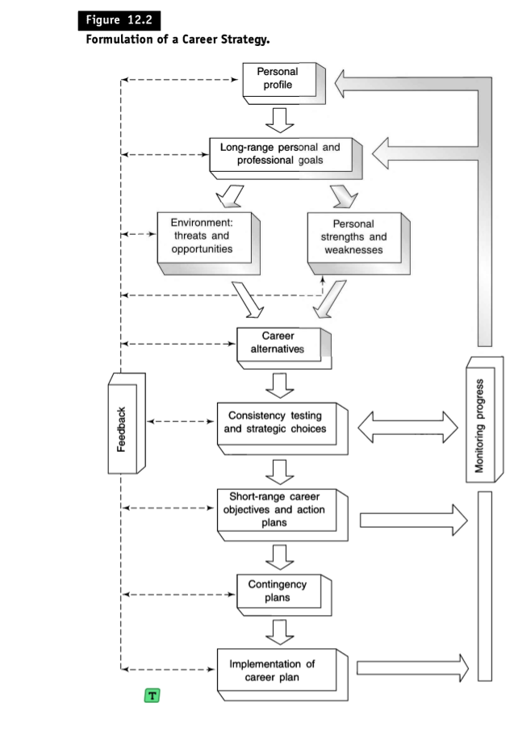

## Principle of Open Competition in Staffing

The principle of open competition, as defined in the sources, states that **vacant positions should be opened to the best-qualified persons available, whether inside or outside the enterprise**. This principle emphasizes prioritizing competence and suitability for the position above other considerations, such as internal seniority or employee relationships.

The sources suggest that this principle ensures managerial competence by allowing organisations to access a wider pool of talent and select the most qualified candidates. This approach counters the potential drawbacks of exclusive promotion from within, such as complacency, limited talent pool, and potential for managerial incompetence due to seniority-based promotions.

While acknowledging the morale benefits often attributed to internal promotions, the sources argue that open competition provides a more effective means of securing the most qualified individuals for managerial roles. However, the sources also highlight that applying the principle of open competition effectively requires organisations to establish **fair and objective methods of appraising and selecting candidates**.

To maintain morale and ensure fairness, organisations need to:

- Implement transparent and objective performance appraisal systems.
- Provide employees with opportunities for development and training to enhance their qualifications.
- Communicate the selection process clearly to all candidates, ensuring they understand the criteria and have a fair chance to compete.

By adhering to these practices, organisations can foster a competitive environment that encourages employees to strive for excellence while ensuring that the most qualified individuals are selected for managerial positions.

---

## Subjective vs. Objective Evaluation: A Concise Differentiation

While the sources don't explicitly define "subjective evaluation" and "objective evaluation", their discussion of managerial appraisal provides a framework for understanding these concepts.

**Subjective evaluation** relies on personal opinions, interpretations, and judgments, often lacking standardized metrics. This approach is often favoured for evaluating complex roles, like managerial positions, where quantifying all aspects of performance can be challenging. Proponents argue that subjective assessment allows for a more holistic view, taking into account the individual's unique context and contributions.

However, the sources caution against relying solely on subjective evaluations, highlighting their susceptibility to personal biases. They emphasize the need for **objective, accurate, and suitable standards** to ensure fairness and accuracy in performance assessments.

**Objective evaluation**, conversely, employs quantifiable data and predetermined criteria to assess performance. The sources advocate for **appraisal against verifiable objectives** as a prime example of this approach. This involves setting SMART goals and gauging the individual's performance against these specific targets. This method promotes transparency, reduces judgment bias, and fosters a more collaborative appraisal process.

The sources acknowledge that even objective measures have limitations. Over-reliance on quantifiable data can lead to a "numbers game" where qualitative aspects of performance, like leadership skills or problem-solving abilities, are overlooked.

Therefore, a **balanced approach**, incorporating both objective metrics and a consideration of qualitative factors, is recommended. This involves supplementing the appraisal against verifiable objectives with an assessment of the manager's effectiveness in executing key managerial activities.

The sources' discussion on stress further highlights the potential impact of subjective evaluations. A stressed manager might exhibit biased judgments, influencing the fairness and accuracy of the appraisal. Objective evaluation methods, with their clear frameworks and measurable criteria, can mitigate such stress-induced bias. [From our conversation history]

In conclusion, the sources suggest that a blend of objectivity and subjectivity is crucial for comprehensive performance evaluations. While objective measures provide a tangible basis for assessment, subjective judgment is essential for contextualizing performance, considering qualitative aspects, and understanding the individual's overall effectiveness within their role.

---

## A Brief Definition of Stress

The sources define **stress** as **an adaptive response**, influenced by **individual differences and psychological processes**, that results from **any external action, situation, or event that places excessive psychological and/or physical demands on a person**. This definition emphasizes that stress is a personalized experience, shaped by an individual's unique characteristics and how they process demanding situations.

The sources further explain this concept by referencing Hans Selye, a prominent stress researcher, who describes stress as "**the rate of all wear and tear caused by life**". This emphasizes the cumulative effect of stressors on an individual's overall well-being.

Stress, in essence, is the body's reaction to challenging circumstances, and its impact varies depending on the individual and the nature of the stressor.

---

## Understanding Individual Differences

The statement "No Average Person" aligns with the sources' emphasis on recognizing the distinct and diverse nature of individuals within organizations. The sources highlight that assuming an "average person" can be detrimental to effective management as it overlooks the unique needs, ambitions, attitudes, and potentials of each individual.

The sources advocate for **consideration of the whole person** in management practices, recognizing that individuals are not merely a collection of separate characteristics but complex beings influenced by internal and external factors. Managers should acknowledge this complexity and adapt their behaviour accordingly, recognizing that what motivates one person may not have the same effect on another.

This principle is evident in the sources' discussion of **motivation**, where they emphasize that **individuals are driven by a variety of needs and desires**. For example, while financial rewards might be a significant motivator for some, others might prioritize job satisfaction, recognition, or opportunities for growth and development.

The sources' exploration of **stress** further underscores the significance of individual differences. They define stress as an "adaptive response" influenced by "individual differences and psychological processes," highlighting that people perceive and react to demanding situations in unique ways. What one person finds stressful, another might not, depending on their personality, coping mechanisms, and past experiences. [From our conversation history]

Furthermore, the sources' examination of **managerial appraisal** emphasizes the importance of considering individual circumstances when evaluating performance. Even objective evaluation methods, like appraisal against verifiable objectives, should be implemented with an awareness of the unique challenges and opportunities faced by each manager. [From our conversation history]

This recognition of individual differences is also crucial in **staffing**. The sources highlight that a company's **internal environment** can significantly influence staffing decisions. A supportive and less stressful work environment is more likely to encourage internal talent to compete for promotions, while a highly stressful environment might deter qualified candidates from applying. [From our conversation history]

In conclusion, the statement "No Average Person" aptly captures the sources' central theme of embracing the individuality of people within organizations. By recognizing and appreciating these differences, managers can create a more engaging, motivating, and productive work environment that fosters growth and success for both individuals and the organization.

---

## Equity Theory Explained

Equity theory, as per the sources, centres around the concept of **fairness in reward distribution** within an organization. It suggests that an individual's motivation is not solely determined by the absolute value of the reward they receive, but rather by their **perception of the fairness of that reward in relation to their efforts and the rewards received by others**.

Essentially, individuals make a subjective judgment about the balance between their **outcomes** (rewards) and **inputs** (efforts, experience, skills, education) compared to the outcomes/inputs ratio of others in similar roles or situations.

**Three scenarios emerge based on this comparative evaluation**:

- **Equity**: When individuals perceive their rewards as equitable compared to others, they experience a sense of fairness and are likely to maintain their current level of effort and performance.
- **Inequity (Under-Reward)**: If individuals believe they are being under-rewarded compared to their contributions and the rewards of others, they might experience feelings of dissatisfaction, leading to potential negative consequences such as reduced effort, decreased productivity, or even leaving the organization.
- **Inequity (Over-Reward)**: Conversely, when individuals perceive their rewards as exceeding what they deem equitable, they might respond by increasing their effort, potentially to justify the higher rewards. However, some individuals might also downplay or discount the rewards to maintain a sense of balance.

The sources highlight that **perceptions of equity are inherently subjective** and can be influenced by biases. Individuals may overestimate their own contributions or the rewards received by others, leading to inaccurate assessments of fairness.

Furthermore, prolonged feelings of inequity can result in amplified reactions to seemingly minor events, potentially leading to significant consequences like resignation.

Equity theory emphasizes the **importance of transparent and fair reward systems** within organizations. Managers should strive to establish clear performance expectations, provide objective feedback, and ensure that reward distribution reflects the actual contributions and efforts of individuals, minimizing the perception of inequity and fostering a more motivated and engaged workforce.

---

## Formulation of a Career Strategy

The sources outline a comprehensive process for formulating a career strategy, akin to developing an organizational strategy. This systematic approach involves several key steps, as illustrated in Figure 12-2 from source:

### 1. Preparation of a Personal Profile

The initial step involves gaining self-awareness. This requires introspection to understand personal strengths, weaknesses, values, and ambitions. The sources do not provide a specific method for accomplishing this, but suggest asking oneself questions like, "Am I an introvert or an extrovert?" or "What are my attitudes towards time, achievement, work, material things, and change?".

### 2. Development of Long-Range Personal and Professional Goals

Once a personal profile is established, the next step is to define long-term personal and professional goals. The sources emphasize the importance of having a clear vision, akin to an airplane having a flight plan. This involves making choices and commitments, acknowledging that pursuing one path might preclude pursuing others. The time frame for these goals should align with the "commitment principle," encompassing the period required to fulfil the commitments made in the present.

### 3. Analysis of the Environment: Threats and Opportunities

A thorough analysis of the external environment is crucial for identifying potential opportunities and threats. This analysis should consider economic, social, political, technological, and demographic factors, including the labor market and competition. The sources recommend focusing on factors critical to personal success, acknowledging the dynamic nature of the environment and the need for forecasting future trends.

### 4. Analysis of Personal Strengths and Weaknesses

This step involves aligning personal strengths and weaknesses with the opportunities and threats identified in the environmental analysis. The sources suggest categorizing capabilities as technical, human, conceptual, or design, recognizing that the relative importance of these skills varies across hierarchical levels in an organization.

### 5. Development of Strategic Career Alternatives

Based on the previous steps, individuals can develop strategic career alternatives. The sources emphasize the importance of capitalizing on strengths to exploit opportunities. For instance, if one possesses strong computer skills and the market demands programmers, pursuing a career in programming would be a strategic option. Alternatively, if one lacks certain skills but identifies a promising opportunity, a development strategy to acquire those skills might be pursued.

### 6. Consistency Testing and Strategic Choices

This stage involves evaluating the strategic alternatives against personal values, ambitions, and risk tolerance. While a rational choice based on strengths and opportunities might seem ideal, it might not align with an individual's preferences or passions. The sources highlight that strategic choices often involve trade-offs and require balancing personal fulfilment with rational considerations.

### 7. Development of Short-Range Career Objectives and Action Plans

Once a long-term career direction is established, the focus shifts to developing short-term objectives and action plans. These objectives, which can be integrated into the performance appraisal process, should be specific, measurable, achievable, relevant, and time-bound (SMART). Action plans outline the steps required to achieve these objectives, ensuring alignment between long-term aspirations and immediate actions.

### 8. Development of Contingency Plans

The sources acknowledge that career plans operate within an environment of uncertainty. Therefore, developing contingency plans based on alternative assumptions is crucial. This allows individuals to adapt to unexpected changes or setbacks and maintain career momentum.

### 9. Implementation of the Career Plan

The implementation phase involves actively pursuing the chosen career path. This might involve seeking new roles, acquiring new skills, or networking with professionals in the chosen field. The sources suggest integrating career planning into the performance appraisal process, where career goals and personal ambitions can be considered during selection, promotion, and training decisions.

### 10. Monitoring Progress

The final step involves regularly monitoring progress toward career goals and adjusting plans as needed. This continuous evaluation, often conducted during performance appraisals, ensures that the career strategy remains relevant and effective.

### Diagram Showing the Flow of Career Strategy Formulation

This diagram illustrates the sequential flow of the career strategy formulation process, highlighting the interconnectedness of each step. The sources emphasize that while the process might appear linear, it often involves revisiting earlier steps based on new insights or changes in circumstances.

---

## Simplifying Performance Appraisal

The sources present a simplified model of performance appraisal, as depicted in Figure 12-1. This model outlines a three-pronged approach to evaluating managerial performance:

### 1. The Formal Comprehensive Appraisal

The foundation of this model is the **formal comprehensive appraisal**, conducted at least annually. This in-depth review serves as a structured platform for evaluating a manager's overall performance. While the sources acknowledge that the specific timing of these reviews can vary based on organizational practices and individual circumstances, they emphasize the importance of **regular and consistent assessments**.

### 2. Progress or Periodic Reviews

Supplementing the comprehensive appraisal are **progress or periodic reviews**. These shorter, more informal assessments occur more frequently throughout the year, ensuring ongoing communication and feedback between superiors and subordinates. They provide an opportunity to identify potential roadblocks hindering performance, adjust priorities, and renegotiate objectives based on evolving circumstances.

### 3. Continuous Monitoring

The third element of this model is **continuous monitoring**, representing an ongoing, real-time assessment of performance. This proactive approach enables immediate identification and resolution of deviations from plans, preventing minor issues from escalating into significant problems.

### Key Considerations

The sources highlight several key aspects of this simplified model:

- **Focus on Performance**: The appraisal process should evaluate both a manager's ability to achieve established goals and their overall effectiveness in executing key managerial activities. This dual focus ensures a comprehensive assessment of their capabilities.
- **Flexibility**: The model recognizes that the frequency and timing of appraisals can vary based on the nature of the task, organizational norms, and individual situations. While annual comprehensive reviews are recommended, the specific schedule should be tailored to the context.
- **Open Communication**: The model emphasizes the importance of ongoing communication and feedback between superiors and subordinates. This transparent approach ensures alignment, facilitates early problem identification, and fosters a collaborative environment for performance improvement.
- **Integration with Management by Objectives**: The sources underscore the connection between performance appraisal and management by objectives. When effectively implemented, MBO provides a framework for setting verifiable objectives, which then become the yardsticks for performance measurement during appraisals. This integration streamlines the evaluation process and reinforces the importance of goal-oriented management.

### Diagrammatic Representation

This diagram highlights the iterative nature of performance appraisal, with each review informing subsequent actions and contributing to the achievement of desired performance levels.

This simplified model, while concise, underscores the importance of a structured, multifaceted, and ongoing approach to performance appraisal. It encourages managers to move beyond traditional, annual reviews and embrace a more dynamic and collaborative process that fosters continuous improvement and supports individual and organizational success.

---

## Understanding Maslow's Hierarchy of Needs Theory

The sources discuss Maslow's hierarchy of needs theory in the context of motivation. This widely recognized theory, proposed by psychologist Abraham Maslow, suggests that human needs are structured in a hierarchical order, progressing from the most basic to the most complex. The theory posits that once a lower-level need is satisfied, it ceases to be a primary motivator, and the individual's focus shifts to fulfilling the next level in the hierarchy.

### The Five Levels of Needs

Maslow identified five levels of needs, depicted in Figure 14-1 from the sources:

1.  **Physiological Needs**: These fundamental needs, essential for human survival, encompass requirements such as food, water, warmth, shelter, and sleep. Until these needs are met sufficiently to sustain life, Maslow argued, other needs hold little motivational sway.

2.  **Security or Safety Needs**: Once physiological needs are met, the desire for safety and security emerges. This includes seeking protection from physical harm, threats, and the fear of losing essential resources like a job, property, food, or shelter.

3.  **Affiliation or Acceptance Needs**: As social beings, humans crave belonging and acceptance from others. This need drives individuals to seek social connections, build relationships, and feel part of a group.

4.  **Esteem Needs**: As individuals satisfy their need for belonging, the desire for esteem and recognition emerges. This includes the need for self-esteem, confidence, and a sense of achievement, as well as the desire for respect and recognition from others. This need often manifests in a pursuit of power, prestige, and status.

5.  **Need for Self-Actualization**: Sitting atop the hierarchy is the need for self-actualization, representing the pinnacle of human motivation. This need encompasses the desire to reach one's full potential, to strive for personal growth, and to achieve a sense of fulfillment and purpose. This drive pushes individuals to continuously learn, grow, and contribute in ways that align with their values and talents.

### Criticisms and Reinterpretations

While influential, Maslow's theory has faced criticism and undergone reinterpretations. Some studies, cited in the sources, challenge the strict hierarchical structure, suggesting that individuals might experience multiple needs simultaneously or that the order of needs may vary depending on individual circumstances and life experiences.

For instance, research by Edward Lawler and J. Lloyd Suttle found limited support for a strict hierarchy, suggesting instead a broader categorization of biological needs and "other needs." They observed that while biological needs take precedence, the strength and order of "other needs" varied significantly between individuals.

Similarly, a study by Douglas T. Hall and Khalil Nougaim, also mentioned in the sources, found that while managers tend to prioritize higher-level needs as they advance in their careers, this shift may be attributed to career progression rather than a sequential satisfaction of lower-level needs.

### Relevance to Management Practice

Despite criticisms, Maslow's theory offers valuable insights for managers. It emphasizes the importance of understanding employee needs and designing work environments that support their fulfillment. Recognizing that different employees may be motivated by different needs, managers can tailor their leadership styles and motivational strategies to better align with individual aspirations and enhance overall workplace satisfaction and productivity.

The sources highlight the connection between Maslow's theory and other motivational approaches, such as Herzberg's two-factor theory and Vroom's expectancy theory. While these theories offer different perspectives on motivation, they share a common thread with Maslow's work: acknowledging the complexity of human needs and emphasizing the role of managers in creating environments that foster motivation and support individual and organizational success.

---

## Significance of Concepts in the Communication Process Model

The sources emphasize the importance of communication in management and provide a communication process model to illustrate the key elements involved. This response will elaborate on the significance of each concept in this model, drawing upon information from the sources.

### 1. Sender

The sender is the originator of the message and holds a crucial role in the communication process. The sender's responsibility is to:

- **Conceptualize the Message**: This involves having a clear thought or idea that they wish to convey.
- **Encode the Message**: The sender must translate their thought into a form understandable to both themselves and the receiver. This encoding can take various forms, such as spoken language, written words, visual cues, or even computer language.
- **Choose the Appropriate Channel**: The sender must select a suitable channel for transmitting the message, considering factors like the nature of the message, the receiver's preferences, and situational constraints.
- **Ensure Clarity**: The sender must articulate the message in a way that minimizes the risk of misinterpretation. This includes using clear language, providing context, and anticipating potential areas of confusion.

The sender's effectiveness in fulfilling these responsibilities directly impacts the success of the communication process.

### 2. Message

The message is the information the sender wants to convey. It can be:

- **Verbal**: Spoken words or written text.
- **Nonverbal**: Facial expressions, body language, and tone of voice.
- **Visual**: Images, charts, graphs, and other visual aids.

The message needs to be:

- **Relevant**: Aligned with the receiver's needs and interests.
- **Clear**: Easily understandable and free from ambiguity.
- **Concise**: Avoiding unnecessary jargon or complexity.
- **Credible**: Supported by facts and presented honestly.

The clarity, relevance, and credibility of the message significantly impact the receiver's ability to understand and accept it.

### 3. Channel

The channel is the medium through which the message travels from the sender to the receiver. It can be:

- **Oral**: Face-to-face conversations, telephone calls, presentations, and meetings.
- **Written**: Memos, letters, reports, emails, and white papers.
- **Electronic**: Email, instant messaging, video conferencing, social media, and other digital platforms.

The choice of channel depends on:

- **Urgency**: Some channels, like telephone calls or instant messaging, offer faster communication than written forms.
- **Complexity**: Detailed or complex information might be better conveyed in writing, allowing for careful consideration and reference.
- **Formality**: The level of formality required for the communication dictates the choice of channel. Formal situations might require written communication, while informal exchanges can occur through oral channels.
- **Cost**: Different channels have different cost implications, with some, like face-to-face meetings, involving higher costs than electronic communication.

Selecting the right channel is critical for ensuring that the message reaches the intended audience effectively and efficiently.

### 4. Receiver

The receiver is the individual or group for whom the message is intended. The receiver's role in the communication process involves:

- **Receiving the Message**: This involves being attentive to the message being transmitted through the chosen channel.
- **Decoding the Message**: The receiver interprets the symbols and language used by the sender, extracting meaning from the message.
- **Understanding the Message**: This involves comprehending the intended meaning of the message and its implications.
- **Providing Feedback**: The receiver offers feedback to the sender, indicating whether the message has been understood and what actions, if any, they will take in response.

The receiver's ability to decode and understand the message directly impacts the effectiveness of the communication process. Factors such as their knowledge, experience, attention span, and potential biases can influence their interpretation.

### 5. Noise

Noise represents any interference that disrupts the communication process, hindering the transmission or reception of the message. It can be:

- **Physical Noise**: External distractions like loud sounds, uncomfortable temperatures, or visual obstructions.
- **Psychological Noise**: Internal distractions arising from the receiver's state of mind, including pre-existing biases, emotional states, or preoccupation with other thoughts.
- **Semantic Noise**: Misunderstandings arising from the use of unfamiliar language, jargon, or ambiguous wording.
- **Cultural Noise**: Differences in cultural backgrounds or communication styles that lead to misinterpretations.
- **Organizational Noise**: Factors within the organization that impede communication flow, such as a rigid hierarchy, information overload, or poorly defined communication channels.

Effective communication requires minimizing noise to ensure the message is transmitted and received as intended.

### 6. Feedback

Feedback is the receiver's response to the sender's message, providing an indication of whether the message has been understood and what impact it has had. Feedback can be:

- **Verbal**: Spoken or written responses.
- **Nonverbal**: Facial expressions, body language, or actions.
- **Direct**: Explicitly stating their understanding or reaction to the message.
- **Indirect**: Implied through their actions or subsequent behaviour.

Feedback is essential for:

- **Confirming Understanding**: It verifies whether the receiver has interpreted the message as the sender intended.
- **Clarifying Misunderstandings**: It allows for addressing any discrepancies in interpretation and ensuring that the intended meaning is conveyed.
- **Enhancing Communication Effectiveness**: It provides the sender with insights into how to improve their communication style and approach.
- **Facilitating Adjustment**: It allows the sender to modify their message or approach based on the receiver's feedback.

Encouraging and actively seeking feedback is crucial for establishing effective two-way communication and ensuring that the intended message is received and understood.

### The Interconnectedness of Concepts

The communication process model highlights the interconnectedness of these concepts. Effective communication requires the sender to carefully craft and transmit a clear message, taking into account the receiver's perspective and potential sources of noise. The receiver, in turn, must be attentive, decode the message accurately, and provide feedback to confirm understanding. By understanding the significance of each concept and their interplay, managers can enhance their communication skills and create a more effective and efficient flow of information within their organizations.
