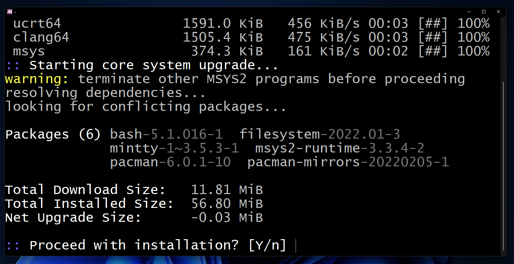
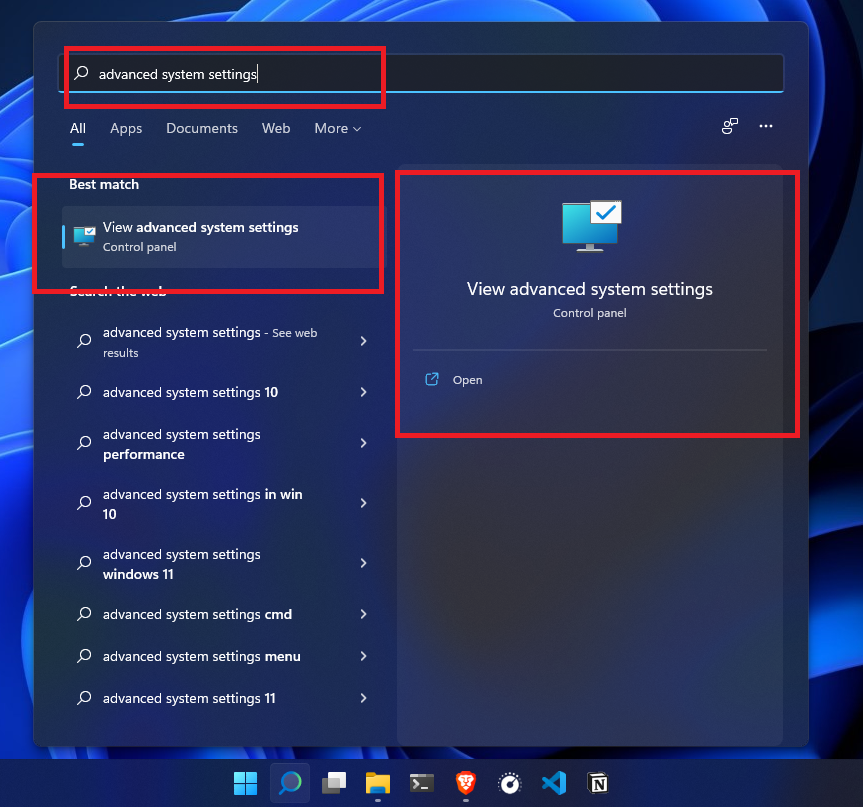

# Steps for Installing G++ on Windows

ℹ️ For reference you can check this website: [How to Install C and C++ Compilers on Windows](https://www.freecodecamp.org/news/how-to-install-c-and-cpp-compiler-on-windows/)

---

## Step 1 - Install MSYS2

Firstly we need to download an executable file from **MSYS2**. Go to the official website of **MSYS2**: [https://www.msys2.org/](https://www.msys2.org/).

---

## Step 2 - Open MSYS2 MSYS terminal

Let me assume that we have opened the **MSYS2 MSYS** terminal successfully.

Apply the command **`pacman -Syu`** to update the package database and the base packages.

Type **`Y`** and press the enter key if you get this type of installation prompt.

- After typing **`Y`** a couple of times, this installation part will be completed and the terminal will be closed.
- Next open the terminal manually to update the the rest of the packages.

---

## Step 3 - Open MSYS2 MSYS Again

- Click the start button.
- Search the folder named **MSYS2 64bit**. Click on the folder to expand and get the terminal. Open the terminal by clicking **MSYS2 MSYS**.
  

- Update the rest of the packages by applying the command, pacman -Su. You might need to apply the command **`pacman -Sy`** if the terminal tells you to do that.
  

- If you get any installation prompt,

  - then you need to type **`Y`** or **`y`** and press the enter key.
    

- Wait a little to finish the installation.

---

## Step 4 - Install the GCC and G++ Compilers

- Click the start button. Find the **MSYS2 64bit** folder. Click on that folder to expand it.
- If you are using a **64 bit operating system** like I am, then we need to use the **MSYS2 MinGW x64** terminal. Click on the terminal to open that.
  

- As I am using a 64 bit operating system, I have opened the terminal for 64 bit. Apply the command **`pacman -S mingw-w64-x86_64-gcc`** to install the compilers.
  

- Wait for a little while.
- Type **`Y`** or **`y`** and press the enter key if you get the installation prompts.
- Give it some time to finish the installation process.

---

## Step 5 - Add the Directory to the Path of the Environment Variables

- Open the file explorer.
- Navigate to **`C:\msys64\mingw64\bin\`**
- Copy the directory.
  

- Open the **Advanced System Settings**. You can do that in many ways. A simple way is to simply click the start button and search for it like the below screenshot.
  

- Click **Environment Variables** from the **Advanced tab**.
  

- Click on **Path** and select that. Then click **Edit**.
  

- A window will appear as below:
  

- Click **New**.
  

- An editable blank box will appear.
  

- Paste the directory here.
  
  

- Click **OK**.
  
- Click **OK**.
  
- Click **OK**.
  

---

## Step 6 - Check the Install

Now it is time to check whether we have successfully installed all of the above or not.

Open the **terminal** / **PowerShell** / **CMD** and apply the commands serially:

For checking the **G++ version**:

**`g++ version`**

