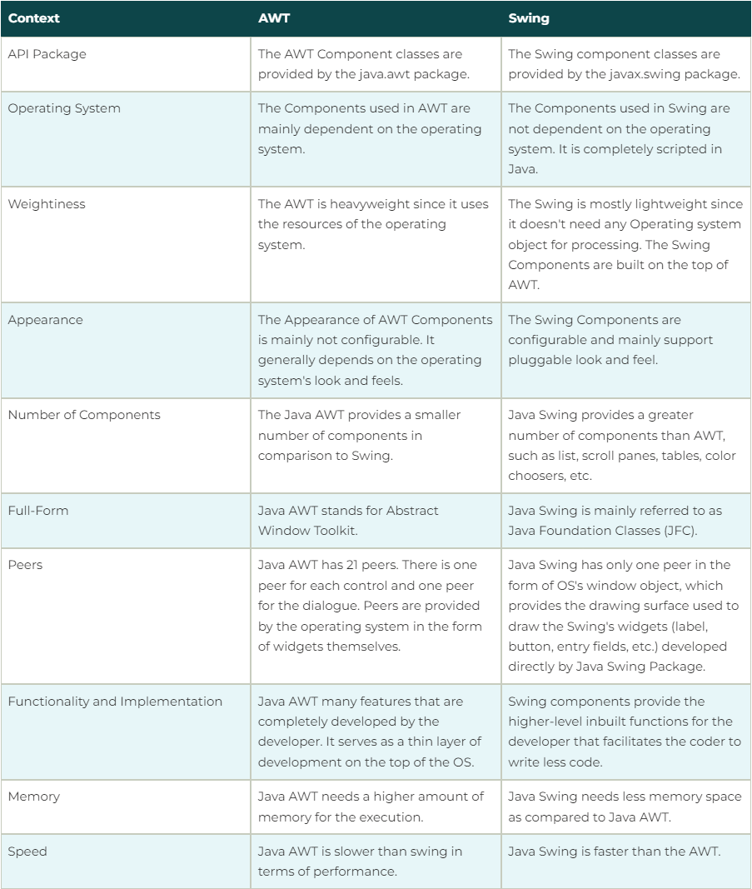
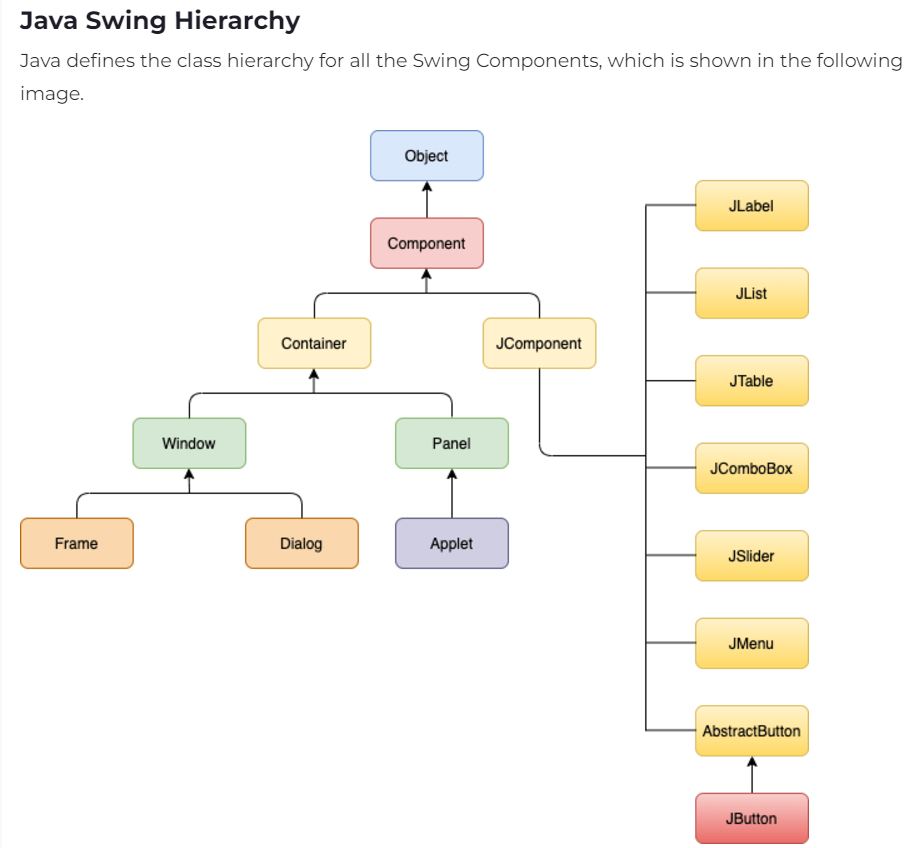

## 0. Define Applet in Java.

An applet in Java is a small Java program that runs within a web browser or an applet viewer. It is primarily designed for embedding in HTML pages to provide dynamic and interactive features to websites.

---

## 1. Define Java Collection.

In Java, a Collection is a framework that provides an architecture to store and manipulate a group of objects. Collections are used to perform various operations such as searching, sorting, insertion, deletion, and manipulation of data. The Java Collection framework includes a variety of classes and interfaces that help in handling data.

---

## 2. What is Java AWT?

Java AWT (Abstract Window Toolkit) is a set of APIs used by Java programmers to create graphical user interfaces (GUIs). It is part of the Java Foundation Classes (JFC) and provides a rich set of GUI components like windows, buttons, and text fields. AWT is the original platform-dependent windowing, graphics, and user-interface widget toolkit that precedes Swing in the Java ecosystem.

---

## 3. What for is Java Bean technology is used?

JavaBeans technology is used for building reusable software components in Java. These components are often referred to as "beans," and they are designed to be manipulated visually within a builder tool.

---

## 4. What is Java Servlet?

Java Servlets are server-side Java programs that handle requests and responses in web applications. They run on a web server or application server and are used to create dynamic web content.

---

## 5. List the Applet Life Cycle methods.

Java applets are small programs that run within a web browser. They have a well-defined lifecycle with specific methods that are called at different stages of their execution. Here are the main lifecycle methods of a Java applet:

### init():

This method is called once when the applet is first loaded. It is used to perform initialization tasks, such as setting up user interface components or allocating resources.

### start():

This method is called after init() and each time the applet is revisited in the browser. It is used to start or resume the applet's execution, such as starting animations or threads.

### stop():

This method is called when the applet is no longer visible, for example, when the user navigates away from the page containing the applet. It is used to stop animations, threads, or other activities.

### destroy():

This method is called when the applet is about to be destroyed, such as when the browser is closed. It is used to release resources, perform clean-up tasks, and ensure that the applet's execution is properly terminated.

### paint(Graphics g):

This method is used to draw the applet's output on the screen. It is called whenever the applet's display area needs to be redrawn, such as when the applet is first displayed or when the user resizes the browser window.

---

## 6. Compare “extends” and “implements” operations in Java

while extends means the derived class inherits the member methods and member variables from the base class and allows only single inheritance, implements means the derived class will only inherit the interface and allows multiple inheritance, without the definition of the methods, of the class/interface in question.

---

## 7. What is Scanner? Explain how scanner is used in Java using an example.

The Scanner class in Java is used to read input from various sources, typically the standard input stream (keyboard). It allows you to read different data types like integers, floating-point numbers, strings, and more.

```java
import java.util.Scanner;

public class ScannerExample {
    public static void main(String[] args) {
        Scanner scan = new Scanner(System.in);
        // Read an integer
        System.out.print("Enter an integer: ");
        int number = scan.nextInt();
        // Read a string
        System.out.print("Enter your name: ");
        String name = scan.nextLine();

        System.out.println("You entered: " + number);
        System.out.println("Your name is: " + name);

        scanner.close(); // Close the scanner to release resources
    }
}
```

---

## 8. What is the purpose of finally clause? give example.

The finally clause in Java is used to execute a block of code regardless of whether an exception is thrown or caught in the preceding try block. This is particularly useful for performing essential cleanup tasks, such as closing files, releasing resources, or committing database transactions.

```java
import java.io.BufferedReader;
import java.io.FileReader;
import java.io.IOException;

public class FinallyBlockExample {
    public static void main(String[] args) {
        BufferedReader reader = null;
        try {
            reader = new BufferedReader(new FileReader("myfile.txt"));
            String line = reader.readLine();
            System.out.println(line);
        } catch (IOException e) {
            System.out.println("An error occurred: " + e.getMessage());
        } finally {
            if (reader != null) {
                try {
                    reader.close();
                } catch (IOException e) {
                    System.out.println("Error closing file: " + e.getMessage());
                }
            }
        }
    }
}
```

### Explanation:

try Block: This block contains code that might throw an exception, such as reading from a file.
catch Block: This block handles the exception if it occurs.
finally Block: This block executes no matter what, whether an exception is thrown or not. In this case, it closes the BufferedReader to release the file resource.

---

## 9. Write a java program to reverse the given string.

```java
import java.util.Scanner;

public class ReverseString {
    public static void main(String[] args) {
        Scanner scanner = new Scanner(System.in);
        System.out.print("Enter a string: ");
        String inputString = scanner.nextLine();

        String reversedString = "";
        // Method 1: Using a for loop
        for (int i = inputString.length() - 1; i >= 0; i--) {
            reversedString += inputString.charAt(i);
        }

        System.out.println("Reversed string: " + reversedString);
    }
}
```

---

## 10. Explain the concept of inner classes in java.

Inner classes, also known as nested classes, are classes defined within another class. They provide a way to encapsulate related classes and control their accessibility.

### Types of Inner Classes:

- **Static Nested Classes**:

  - Declared with the static keyword.
  - Can be accessed without creating an instance of the outer class.
  - Cannot access non-static members of the outer class.

- **Instance Inner Classes**:

  - Declared without the static keyword.
  - Can access all members of the outer class, including private members.
  - Must be created within an instance of the outer class.

- **Local Inner Classes**:

  - Declared within a method or block.
  - Can access local variables of the enclosing method or block if they are declared as final.

- **Anonymous Inner Classes**:

  - A special type of inner class that is declared and instantiated in a single statement.
  - Often used to implement interfaces or extend classes without defining a separate class.

### Key Points:

- Inner classes can be used to model closely related classes and improve code organization.
- They can help in achieving encapsulation and hiding implementation details.
- Inner classes can be used to create more concise and readable code.
- However, excessive use of inner classes can make code more complex to understand and maintain.

By understanding the different types of inner classes and their appropriate use cases, you can write more effective and elegant Java code.

### 1. Static Nested Class

```java
class OuterClass {
    static class StaticInnerClass {
        public void display() {
            System.out.println("This is a static inner class.");
        }
    }

    public static void main(String[] args) {
        OuterClass.StaticInnerClass innerObject = new OuterClass.StaticInnerClass();
        innerObject.display();
    }
}
```

### 2. Instance Inner Class

```java
class OuterClass {
    int outerVariable = 10;

    class InnerClass {
        int innerVariable = 20;

        void display() {
            System.out.println("Outer variable: " + outerVariable);
            System.out.println("Inner variable: " + innerVariable);
        }
    }

    public static void main(String[] args) {
        OuterClass outer = new OuterClass();
        OuterClass.InnerClass inner = outer.new InnerClass();
        inner.display();
    }
}
```

### 3. Local Inner Class

```java
class OuterClass {
    public void outerMethod() {
        class LocalInnerClass {
            public void display() {
                System.out.println("This is a local inner class.");
            }
        }

        LocalInnerClass innerObject = new LocalInnerClass();
        innerObject.display();
    }
}
```

### 4. Anonymous Inner Class

```java
interface MyInterface {
    void myMethod();
}

class OuterClass {
    public void outerMethod() {
        MyInterface myInterface = new MyInterface() {
            @Override
            public void myMethod() {
                System.out.println("This is an anonymous inner class.");
            }
        };

        myInterface.myMethod();
    }
}
```

---

## 11. Explain multiple inheritance in Java using a sample program

While Java doesn't directly support multiple inheritance of classes, it offers a workaround using interfaces. This allows a class to inherit methods from multiple sources, avoiding the complexities associated with traditional multiple inheritance.

**Interfaces in Java**:

- Interfaces define a set of abstract methods that a class must implement.
- A class can implement multiple interfaces, effectively achieving multiple inheritance of methods.

---

## 12. Explain java packages with example.

Java packages are used to organize classes and interfaces into a hierarchical structure. This helps in managing large projects, avoiding naming conflicts, and improving code reusability.

### Why Use Packages?

- **Namespace Management**: Packages provide a namespace for classes and interfaces, preventing naming conflicts.
- **Modularity**: Packages can be used to group related classes and interfaces, making the code more modular.
- **Reusability**: Packages can be reused across different projects.
- **Access Control**: Packages can be used to control the visibility of classes and interfaces.

---

## 13. Write short notes on Java AWT.

Java AWT is a platform-dependent API used to create graphical user interfaces (GUIs). It provides a set of classes and interfaces for building components like buttons, labels, text fields, etc.

### Key Components:

- **Components**: Basic building blocks of a GUI, such as buttons, labels, text fields, etc.
- **Containers**: Containers hold and organize components. Examples include Frame, Panel, and Applet.
- **Layout Managers**: Used to arrange components within containers. Examples include FlowLayout, BorderLayout, GridLayout, and CardLayout.
- **Event Handling**: Provides mechanisms for handling user interactions, such as mouse clicks, keyboard input, etc.

---

## 14. Write short notes on Java SWING.

Java Swing is a set of GUI components used to create desktop applications. It provides a rich set of components like buttons, labels, text fields, and more. It's more flexible and platform-independent than AWT.

### Key Features:

- **Platform-Independent**: Swing components have a consistent look and feel across different platforms.
- **Lightweight Components**: Swing components are lightweight, which means they consume fewer system resources.
- **Rich Feature Set**: It offers a wide range of components and layout managers.
- **Customizable**: Swing components can be customized extensively to create unique user interfaces.
- **Event Handling**: It provides a robust event handling mechanism to respond to user interactions.

### Common Swing Components:

- **JFrame**: Top-level container for creating window-based applications.
- **JPanel**: Container for grouping components.
- **JButton**: Button component for user interaction.
- **JLabel**: Label component for displaying text.
- **JTextField**: Text field component for user input.
- **JTextArea**: Text area component for multi-line text input.

---

## 15. Explain the iteration statements in C++ with syntax and example

- for loop, example...
- while loop, example...
- do while loop, example...
- range-based for loop, example...

---

## 16. What are the three categories of control statements used in C++ ? Explain each category with example.

C++ offers three primary categories of control statements to manage the flow of execution in a program:

**1. Sequence Control:**

- Statements are executed sequentially, one after the other.
- This is the default flow of control in C++.

**Example:**

```cpp
#include <iostream>

int main() {
    int x = 10;
    int y = 20;
    int sum = x + y;
    std::cout << "Sum: " << sum << std::endl;
    return 0;
}
```

**2. Selection Control:**

- These statements allow you to choose which code block to execute based on a condition.

  - **if Statement:**

  ```cpp
  if (condition) {
      // code to be executed if condition is true
  } else {
      // code to be executed if condition is false
  }
  ```

  - **switch Statement:**

  ```cpp
  switch (expression) {
      case value1:
          // code to be executed if expression matches value1
          break;
      case value2:
          // code to be executed if expression matches value2
          break;
      default:
          // code to be executed if no match is found
  }
  ```

**3. Iteration Control:**

- These statements allow you to repeat a block of code multiple times.

  - **for Loop:**

  ```cpp
  for (initialization; condition; increment/decrement) {
      // code to be executed
  }
  ```

  - **while Loop:**

  ```cpp
  while (condition) {
      // code to be executed
  }
  ```

  - **do-while Loop:**

  ```cpp
  do {
      // code to be executed
  } while (condition);
  ```

By effectively using these control statements, you can create complex and dynamic C++ programs that can make decisions and perform repetitive tasks.

---

## 17. Explain all the types of Inheritance in C++ using suitable examples.

1. Single Inheritance

```C++
class Animal {
    // ...
};

class Dog : public Animal {
    // ...
};
```

2. Multiple Inheritance

```C++
class Animal {
    // ...
};

class Mammal {
    // ...
};

class Dog : public Animal, public Mammal {
    // ...
};
```

3. Multilevel Inheritance

```C++
class Animal {
    // ...
};

class Mammal : public Animal {
    // ...
};

class Dog : public Mammal {
    // ...
};
```

4. Hierarchical Inheritance

```C++
class Animal {
    // ...
};

class Dog : public Animal {
    // ...
};

class Cat : public Animal {
    // ...
};
```

5. Hybrid Inheritance

```C++
class Animal {
    // ...
};

class Mammal : public Animal {
    // ...
};

class Dog : public Mammal, public Carnivore {
    // ...
};
```

6. Multipath Inheritance (related to Diamond Problem)

```C++
class Animal {
    // ...
};

class Mammal : public Animal {
    // ...
};

class Carnivore : public Animal {
    // ...
};

class Dog : public Mammal, public Carnivore {
    // ...
};
```

In the Multipath Inheritance example, Dog inherits from both Mammal and Carnivore, which themselves inherit from Animal. This creates a diamond-shaped inheritance graph, leading to the Diamond Problem: Dog inherits two copies of Animal's members.

To resolve this, C++ introduces Virtual Inheritance:

```C++
class Animal {
    // ...
};

class Mammal : virtual public Animal {
    // ...
};

class Carnivore : virtual public Animal {
    // ...
};

class Dog : public Mammal, public Carnivore {
    // ...
};
```

By making Mammal and Carnivore virtually inherit from Animal, we ensure Dog only inherits one copy of Animal's members.

---

## 18. Explain in details about Java AWT classes used to develop a window application with Event handling.

Java AWT is a set of classes and interfaces used to create graphical user interfaces (GUIs) in Java. It provides a platform-independent way to develop GUI applications.

Key Classes in AWT:

### Frame:

Represents a top-level window.
Used to create the main window of an application.
Methods: setTitle, setSize, setVisible, setDefaultCloseOperation.

### Panel:

A container that can hold other components.
Used to organize components within a window.
Methods: add, setLayout.

### Label:

Displays text or images.
Methods: setText, setIcon.

### Button:

A clickable button that triggers an action.
Methods: setText, addActionListener.

### TextField:

A single-line text input field.
Methods: setText, getText.

### TextArea:

A multi-line text input area.
Methods: setText, getText.

### Event Handling:

Event handling is a mechanism to respond to user actions, such as clicking a button or typing in a text field. AWT uses the ActionListener interface to handle events.

### Steps to Handle Events:

- **Create an Event Listener**:
  - Implement the ActionListener interface.
  - Override the actionPerformed method.
- **Register the Listener**:
  - Use the addActionListener method to register the listener with a component.
- **Handle the Event**:
  - Write the desired code within the `actionPerformed` method to respond to the event.

### Example

```java
import java.awt.*; // AWT components and containers
import java.awt.event.*; // AWT event handling
import java.util.Random;

// Main class to demonstrate AWT concepts
public class AWTExample extends Frame implements ActionListener {

  private Label label; // Label to display message
  private Button button; // Button to trigger action
  private int counter;
  private Random random = new Random();

  // Constructor to set up the GUI components
  public AWTExample() {
    // Set up the frame properties
    setTitle("AWT Example");
    setSize(500, 400);
    setLayout(null); // Use FlowLayout for arranging components

    // Create a label and add it to the frame
    label = new Label("Click the button to see the message!");
    label.setBounds(20, 20, 200, 50);
    add(label);

    // Create a button and add it to the frame
    button = new Button("Click Me");
    button.setBounds(30, 100, 80, 30);
    add(button);

    // Register the current instance as an action listener for the button
    button.addActionListener(this);

    // Make the frame visible
    setVisible(true);

    // Close the application when the window is closed
    addWindowListener(new WindowAdapter() {
      public void windowClosing(WindowEvent windowEvent) {
        System.exit(0);
      }
    });
  }

  // Handle button click events
  @Override
  public void actionPerformed(ActionEvent e) {
    this.counter++;
    label.setText("Button clicked counter: " + this.counter);
    button.setBounds(random.nextInt(getWidth()-80), 50 + random.nextInt(getHeight()-80), 80, 30);
  }

  // Main method to launch the application
  public static void main(String[] args) {
    new AWTExample(); // Create an instance of the AWTExample class
  }
}
```

### Explanation:

1. **Create a Frame**: A Frame object is created to represent the main window.
2. **Add Components**: Labels, a text field, and a button are added to the frame using the add method.
3. **Event Handling**: The ActionListener interface is implemented, and the actionPerformed method is overridden to handle the button click event.
4. **Display the Result**: The entered text is displayed in the label when the button is clicked.

While AWT is a foundational technology, it's often recommended to use more modern frameworks like Swing or JavaFX for building complex and visually appealing GUI applications.

---

## 19. Explain in details about Java SWING classes used to develop a window application with Event handling

Java Swing is a set of GUI components used to create desktop applications. It provides a rich set of components like buttons, labels, text fields, and more. It's more flexible and platform-independent than AWT.

### **Key Components:**

1. **JFrame:**

   - Top-level container for creating window-based applications.
   - Methods: `setTitle`, `setSize`, `setVisible`, `setDefaultCloseOperation`.

2. **JPanel:**

   - Container for grouping components.
   - Methods: `add`, `setLayout`.

3. **JLabel:**

   - Displays text or images.
   - Methods: `setText`, `setIcon`.

4. **JButton:**

   - A clickable button that triggers an action.
   - Methods: `setText`, `addActionListener`.

5. **JTextField:**

   - A single-line text input field.
   - Methods: `setText`, `getText`.

6. **JTextArea:**
   - A multi-line text input area.
   - Methods: `setText`, `getText`.

### **Event Handling:**

Event handling is a mechanism to respond to user interactions, such as mouse clicks, keyboard input, etc. Swing uses the `ActionListener` interface to handle events.

**Steps to Handle Events:**

1. **Create an Event Listener:**
   - Implement the `ActionListener` interface.
   - Override the `actionPerformed` method.
2. **Register the Listener:**
   - Use the `addActionListener` method to register the listener with a component.
3. **Handle the Event:**
   - Write the desired code within the `actionPerformed` method to respond to the event.

**Example:**

```java
import javax.swing.*;
import java.awt.event.*;

public class SwingExample extends JFrame implements ActionListener {
    private JTextField textField;
    private JLabel label;

    public SwingExample() {
        setTitle("Swing Example");
        setSize(300, 200);
        setDefaultCloseOperation(JFrame.EXIT_ON_CLOSE);
        setLayout(null);

        JLabel label1 = new JLabel("Enter your name:");
        label1.setBounds(20, 20, 100, 20);
        add(label1);

        textField = new JTextField();
        textField.setBounds(120, 20, 150, 20);
        add(textField);

        JButton button = new JButton("Click Me");
        button.setBounds(100, 60, 100, 30);
        button.addActionListener(this);
        add(button);

        label = new JLabel();
        label.setBounds(20, 100, 250, 20);
        add(label);

        setVisible(true);
    }

    public void actionPerformed(ActionEvent e) {
        String name = textField.getText();
        label.setText("Hello, " + name + "!");
    }

    public static void main(String[] args) {
        new SwingExample();
    }
}
```

### Explanation:

1. **Create a JFrame:** A `JFrame` is created and configured with a title, size, and close operation.
2. **Add Components:** Labels, a text field, and a button are added to the frame using `add` method and set their positions and sizes.
3. **Event Handling:** The `ActionListener` interface is implemented, and the `actionPerformed` method is overridden to handle the button click event. When the button is clicked, the text from the text field is retrieved and displayed in the label.
4. **Display the Frame:** The `setVisible(true)` method makes the frame visible.

By understanding these core components and event handling mechanisms, you can create robust and interactive GUI applications using Java Swing.

---

## 20. Difference Between AWT and SWING



---

## 21. Hierarchy of Java SWING classes


